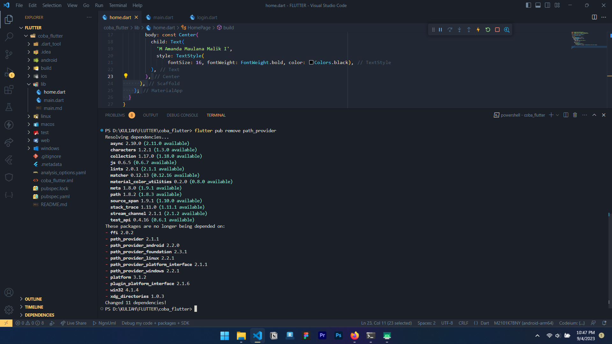
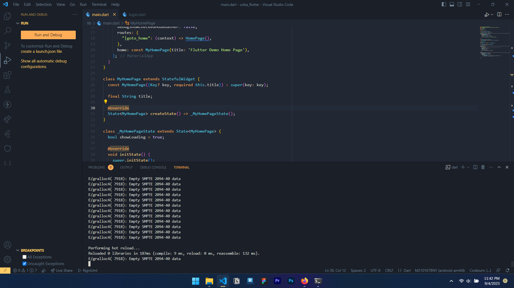
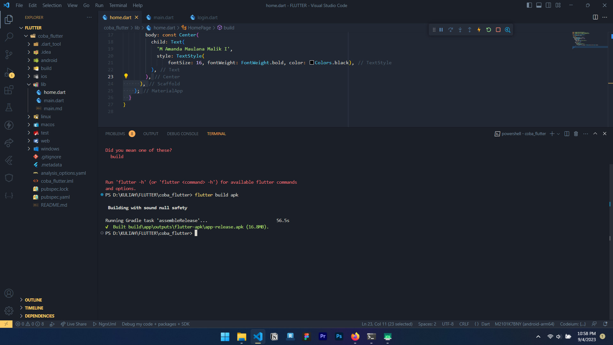
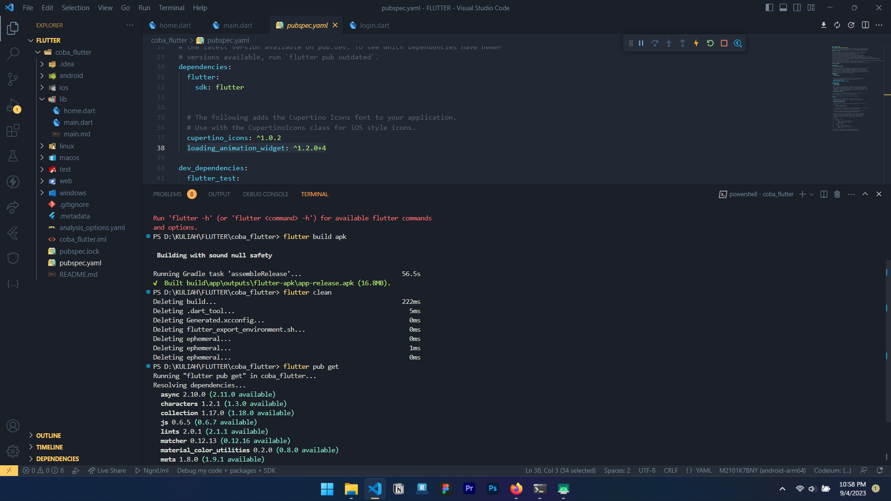
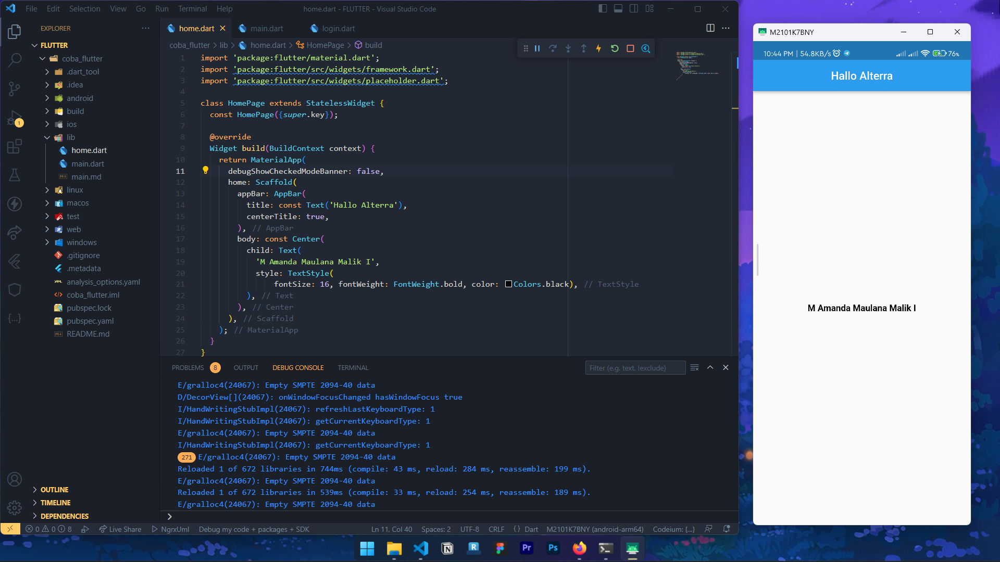

# SOAL PRIORITAS 1
- (1) Instal paket pada proyek Flutter menggunakan Flutter CLI:

- (2) Hapus paket pada proyek Flutter menggunakan Flutter CLI

- (3) Aktifkan Hot Reload pada proyek Flutter menggunakan Flutter CLI:

- (4) Buat APK atau IPA untuk proyek Flutter menggunakan Flutter CLI:

- (5) Bersihkan cache pada proyek Flutter menggunakan Flutter CLI:

# SOAL PRIORITAS 1
- (1) Modifikasi project yang telah kalian buat sehingga mengubah Appbar dengan tulisan “Halo Alterra” dan di halaman bodynya berisi tulisan “Nama saya adalah (NamaKalian)”

