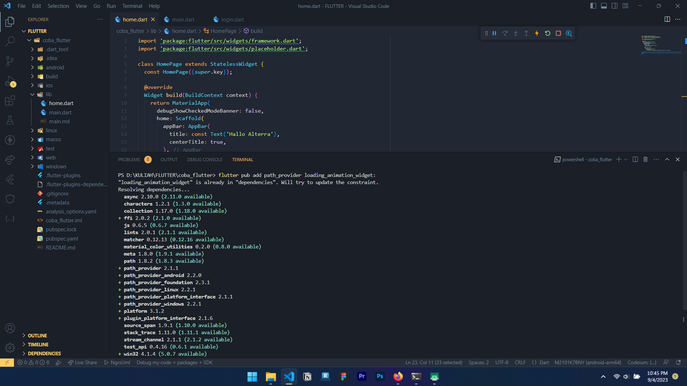

# Soal Prioritas 1
# No 1 Instal paket pada proyek Flutter

# No 2 Hapus paket pada proyek Flutter 

# No 3 Aktifkan hot reload pada proyek flutter

# No 4 Buat APK atau IPA untuk proyek flutter

# No5 Bersihkan cache pada proyek flutter

# Soal Prioritas 2
# Modifikasi Project kalian sesuai perintah

