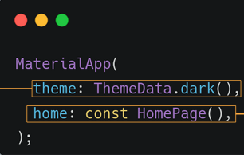
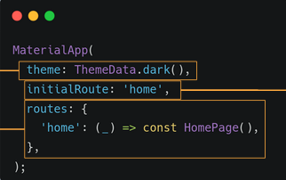
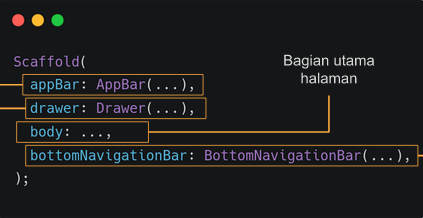
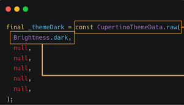
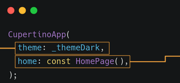
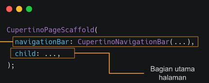

# Flutter Platform Widget
memanfaatkan widget dengan gaya berbeda pada android dan IOS

# MaterialAPP
- widget dasar yang mengemas seluruh widget dalam aplikasi
- widget digunakan android
- diimport dari package::flutter/material.dart
- Struktur widget yang pertama kali dibuka terletak pada bagian home 

- mengatur halaman juga dapat dilakaukan dengan menggunakan routes dan initialRoute  

# Scaffold
- widget dasar untuk membangun sebuah halaman pada MaterialAPP
- Struktur membentuk tata letak dasar sebuah halaman  

# CupertinoAPP
- widget dasar yang mengemas seluruh widget dalam aplikasi
- widget yan gdigunakan pada IOS
- diimport dari package:flutter/cupertino.dart
- Struktur variable _themDark dibuat untuk menyimpan tema
- diperlukan karena cupertino tidak menyediakan themeData.dark()  

- Struktur yang pertama kali dibuka terletak pada home  

- Cupertino pageScaffold adalah scaffold versi cupertino  

